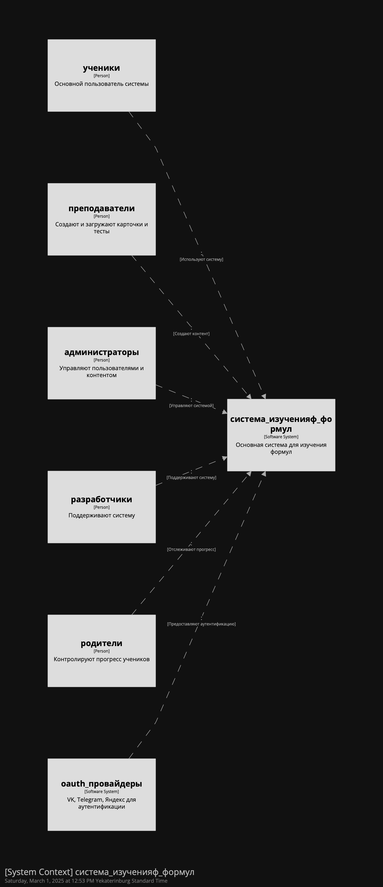
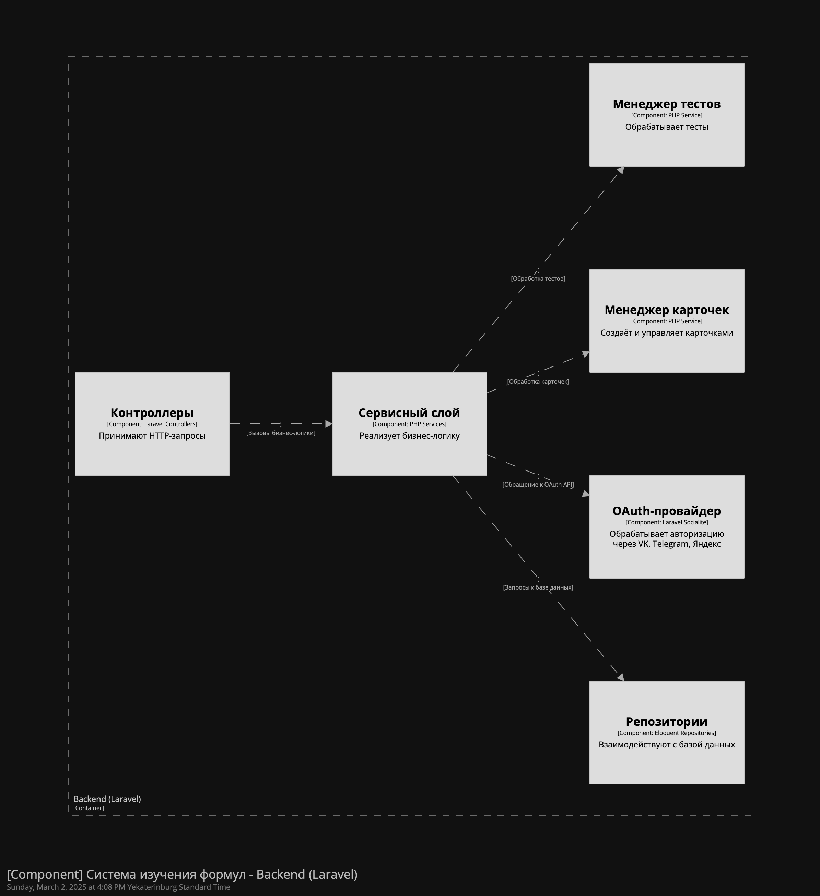

# Лабораторная работа №2

## Тема: Использование нотации C4 model для проектирования архитектуры программной системы

### Цель работы
Получить опыт использования графической нотации для фиксации архитектурных решений.

---

## 1. Введение
C4 Model – это иерархическая методология визуализации архитектуры программного обеспечения, предложенная Саймоном Брауном. Она включает четыре уровня:
- **Диаграмма системного контекста** – отображает систему и её окружение.
- **Диаграмма контейнеров** – показывает основные контейнеры внутри системы и их взаимодействие.
- **Диаграмма компонентов** – детализирует внутреннюю структуру одного контейнера.
- **Диаграмма кода** (не обязательна) – показывает структуру реализации отдельных классов или модулей.

В данной лабораторной работе рассматриваются три уровня C4 Model.

---

## 2. Ожидаемые результаты

- **Диаграмма системного контекста**
- **Диаграмма контейнеров** с пояснением архитектурного стиля
- **Диаграмма компонентов** для одного контейнера

---

## 3. Архитектурный анализ системы

### 3.1. Диаграмма системного контекста
На этом уровне представлена общая картина системы, её пользователей и взаимодействующих систем.

**Основные элементы:**
- **Система изучения формул** (разрабатываемая система)
- **Ученики и студенты** – основной пользовательский сегмент.
- **Преподаватели** – создают и загружают карточки, тесты.
- **Администраторы** – управляют пользователями и контентом.
- **Разработчики** – поддерживают систему.
- **Родители** – контролируют прогресс.
- **Внешние системы**: OAuth-провайдеры (VK, Telegram, Яндекс), фронтенд и мобильное приложение.

### 3.2. Диаграмма контейнеров
На этом уровне показаны основные контейнеры системы и их взаимодействие.

**Выбранная архитектура:**
- **Клиент-серверная архитектура** с разделением на фронтенд, бэкенд и базу данных.
- **Топология с несколькими модулями развертывания**:
   - **Бэкенд (Laravel, PHP)** – реализует бизнес-логику и API.
   - **Фронтенд (React)** – предоставляет UI для пользователей.
   - **Мобильное приложение (React Native)** – кроссплатформенный клиент.
   - **База данных (PostgreSQL)** – хранение карточек, тестов, пользователей.
   - **Сервис аутентификации (OAuth)** – VK, Telegram, Яндекс.

### 3.3. Диаграмма компонентов
На этом уровне рассмотрим один из контейнеров – **бэкенд Laravel**.

**Основные компоненты:**
- **Контроллеры** – обрабатывают запросы API.
- **Сервисный слой** – реализует бизнес-логику.
- **Репозитории** – взаимодействуют с базой данных.
- **Провайдер OAuth** – обеспечивает авторизацию через социальные сети.
- **Менеджер карточек** – создаёт и управляет карточками.
- **Менеджер тестов** – обрабатывает логику тестирования.

---

## 4. Заключение

В данной лабораторной работе было выполнено проектирование архитектуры системы изучения математических и физических формул с использованием нотации C4 Model. Были построены три уровня диаграмм: системного контекста, контейнеров и компонентов. Выбранная архитектура ориентирована на модульность, масштабируемость и интеграцию с внешними сервисами.

