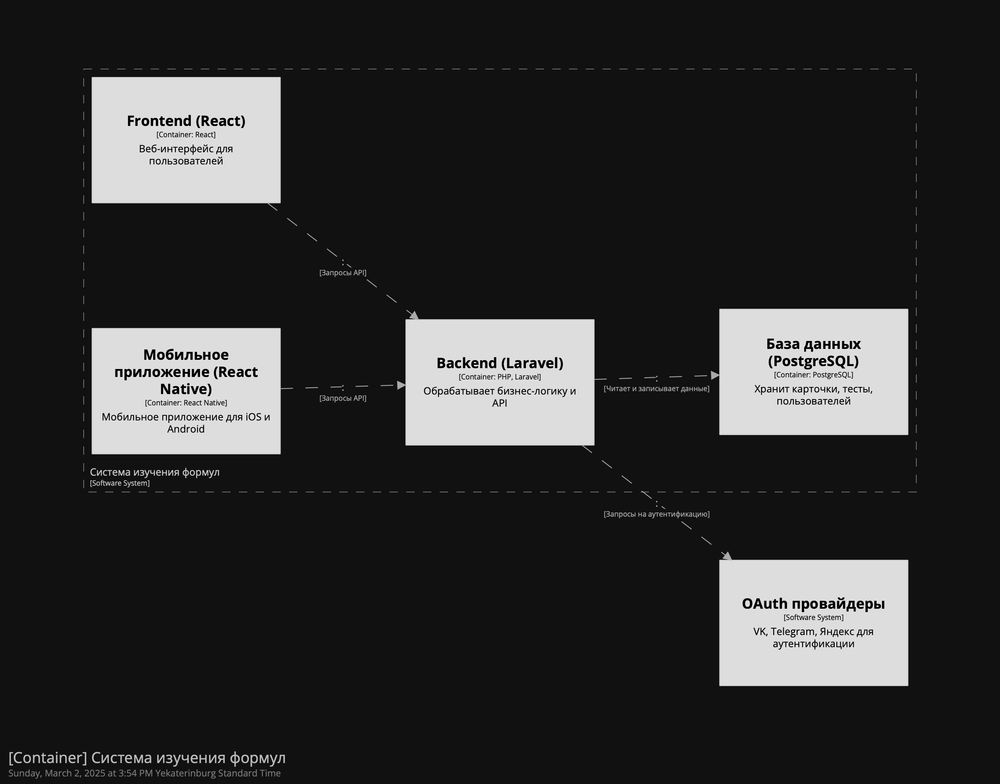
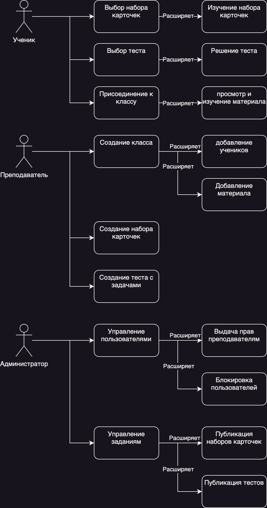
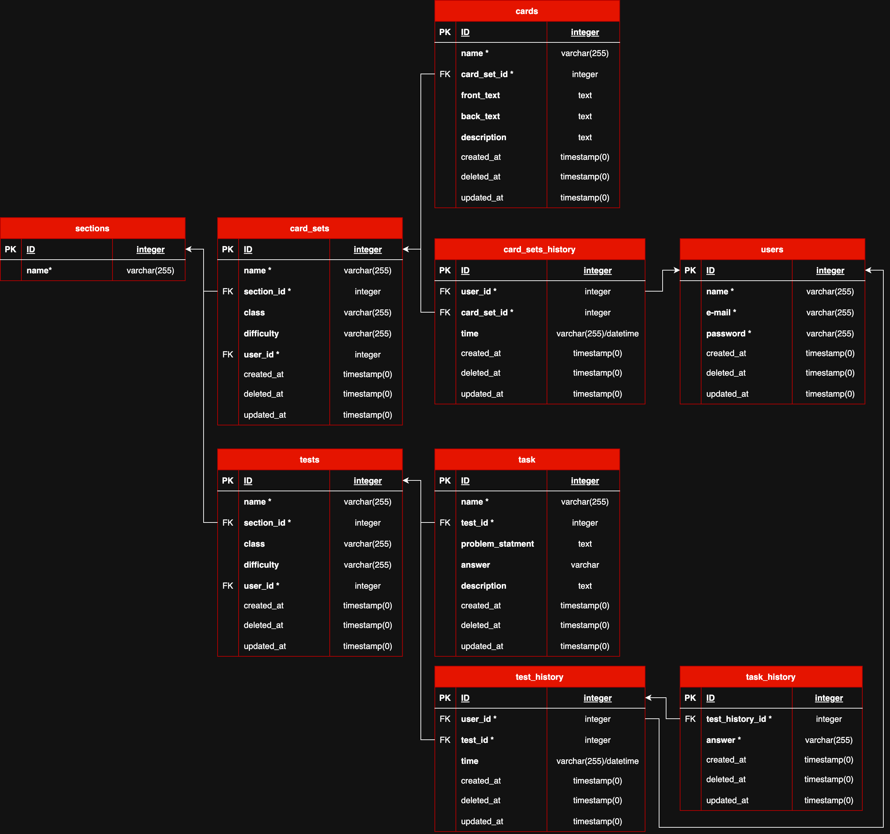

Лабораторная работа №3\
Тема: Использование принципов проектирования на уровне методов и классов

## Цель работы

Получить опыт проектирования и реализации модулей с использованием принципов KISS, YAGNI, DRY, SOLID и др.

## Диаграмма контейнеров



## Диаграмма компонентов


## Диаграмма последовательностей



## Модель БД



## Применение основных принципов разработки

### KISS (Keep It Simple, Stupid)

Принцип реализован путем разбиения сложных функций на простые методы с понятной логикой. Например:

```php
class CardManager {
    public function createCard(string $question, string $answer): Card {
        return new Card($question, $answer);
    }
}
```

### YAGNI (You Ain’t Gonna Need It)

В коде отсутствуют неиспользуемые абстракции. Реализовано только необходимое для текущей функциональности.

### DRY (Don’t Repeat Yourself)

Код избегает дублирования логики, например, вынесение логики в сервисный слой:

```php
class AuthService {
    public function authenticate(string $provider, string $token) {
        // Общая логика для всех OAuth-провайдеров
    }
}
```

### SOLID

- **S** (Single Responsibility) – Классы выполняют одну задачу.
- **O** (Open/Closed) – Добавление новых типов карточек возможно через полиморфизм.
- **L** (Liskov Substitution) – Наследуемые классы не изменяют базовое поведение.
- **I** (Interface Segregation) – Разделение интерфейсов (например, отдельные интерфейсы для создания карточек и тестов).
- **D** (Dependency Inversion) – Использование DI-контейнера.

## Дополнительные принципы разработки

### BDUF (Big Design Up Front)

**Применимость:** Отказ, так как система развивается итеративно, без полного проектирования на старте.

### SoC (Separation of Concerns)

**Применимость:** Используется. Разделение логики между контроллерами, сервисами и репозиториями.

### MVP (Minimum Viable Product)

**Применимость:** Используется. В начале реализуется минимально работающая версия системы.

---