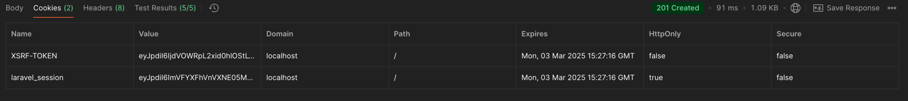
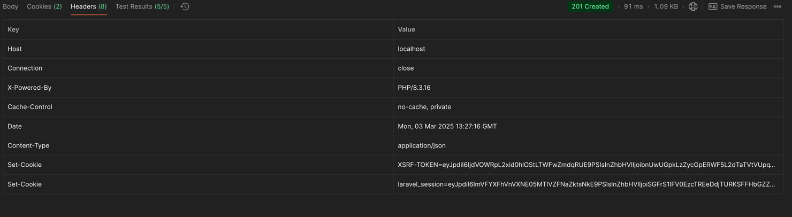
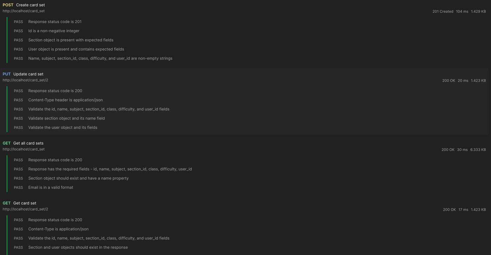
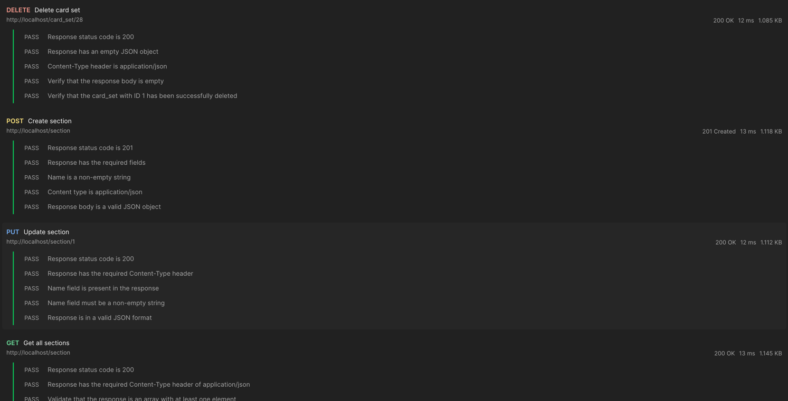

# Лабораторная работа №4
## Тема: Проектирование REST API

### Цель работы
Получить опыт проектирования программного интерфейса.

## Документация по API

### 2. Описание эндпоинтов

## API документация для набора карточек (Card sets)

#### **1. Получение списка набора карточек**
**Метод:** `GET`
**URL:** `/card_set`
**Описание:** Возвращает список наборов карточек.
**Параметры:**
- `page` (integer, optional) — Номер страницы.
- `per_page` (integer, optional) — Количество записей на странице.

**Пример запроса:**
```sh
GET /card_set?page=1&per_page=10
```

**Пример ответа:**
```json
{
  "data": [
    {
      "id": 1,
      "name": "Math Basics",
      "subject": "math",
      "class": "first",
      "difficulty": "easy",
      "section": {
        "id": 1,
        "name": "Math"
      },
      "user": {
        "id": 1,
        "name": "John Doe",
        "email": "johndoe@example.com",
        "password": "password",
        "user_type": "admin",
        "email_verified_at": "2024-01-01 12:00:00"
      }
    }
  ],
  "links": [
    "string"
  ],
  "meta": [
    "string"
  ]
}
```

---

#### **2. Получение информации о наборе карточек**
**Метод:** `GET`
**URL:** `/card_set/{id}`
**Описание:** Возвращает информацию о конкретном наборе карточек.
**Пример запроса:**
```sh
GET /card_set/1
```

**Пример ответа:**
```json
{
  "id": 1,
  "name": "Math Basics",
  "subject": "math",
  "class": "first",
  "difficulty": "easy",
  "section": {
    "id": 1,
    "name": "Math"
  },
  "user": {
    "id": 1,
    "name": "John Doe",
    "email": "johndoe@example.com",
    "password": "password",
    "user_type": "admin",
    "email_verified_at": "2024-01-01 12:00:00"
  }
}
```

---

#### **3. Создание набора карточек**
**Метод:** `POST`
**URL:** `/card_set`
**Описание:** Создаёт нового набора карточек.

**Пример тела запроса:**
```json
{
  "name": "Math Basics",
  "subject": "math",
  "section_id": "1",
  "class": "first",
  "difficulty": "easy",
  "user_id": "1"
}
```

**Пример ответа:**
```json
{
  "id": 1,
  "name": "Math Basics",
  "subject": "math",
  "class": "first",
  "difficulty": "easy",
  "section": {
    "id": 1,
    "name": "Math"
  },
  "user": {
    "id": 1,
    "name": "John Doe",
    "email": "johndoe@example.com",
    "password": "password",
    "user_type": "admin",
    "email_verified_at": "2024-01-01 12:00:00"
  }
}
```

---

#### **4. Обновление набора карточек**
**Метод:** `PUT`
**URL:** `/card_set/{id}`
**Описание:** Обновляет информацию о наборе карточек.

**Пример тела запроса:**
```json
{
  "name": "Math Basics",
  "subject": "math",
  "section_id": "1",
  "class": "first",
  "difficulty": "easy",
  "user_id": "1"
}
```

**Пример ответа:**
```json
{
  "id": 1,
  "name": "Math Basics",
  "subject": "math",
  "class": "first",
  "difficulty": "easy",
  "section": {
    "id": 1,
    "name": "Math"
  },
  "user": {
    "id": 1,
    "name": "John Doe",
    "email": "johndoe@example.com",
    "password": "password",
    "user_type": "admin",
    "email_verified_at": "2024-01-01 12:00:00"
  }
}
```

---

#### **5. Удаление набора карточек**
**Метод:** `DELETE`
**URL:** `/card_set/{id}`
**Описание:** Удаляет набор карточек.

**Пример ответа:**
```json
{}
```

## API документация для разделов (Sections)

### 1. Получение списка разделов
**Метод:** `GET`  
**URL:** `/section`  
**Описание:** Возвращает список разделов.  
**Параметры:**

**Пример запроса:**
```sh
GET /section
```

**Пример ответа:**
```json
[
  {
    "id": 1,
    "name": "Math"
  }
]
```

---

### 2. Получение информации о разделе
**Метод:** `GET`  
**URL:** `/section/{id}`  
**Описание:** Возвращает информацию о конкретном разделе.

**Пример запроса:**
```sh
GET /section/1
```

**Пример ответа:**
```json
{
  "id": 1,
  "name": "Math"
}
```

---

### 3. Создание раздела
**Метод:** `POST`  
**URL:** `/section`  
**Описание:** Создаёт новый раздел.

**Пример тела запроса:**
```json
{
  "name": "Math"
}
```

**Пример ответа:**
```json
{
  "id": 1,
  "name": "Math"
}
```

---

### 4. Обновление раздела
**Метод:** `PUT`  
**URL:** `/section/{id}`  
**Описание:** Обновляет информацию о разделе.

**Пример тела запроса:**
```json
{
  "name": "Mathematics"
}
```

**Пример ответа:**
```json
{
  "id": 1,
  "name": "Mathematics"
}
```

---

### 5. Удаление раздела
**Метод:** `DELETE`  
**URL:** `/section/{id}`  
**Описание:** Удаляет раздел.

**Пример ответа:**
```json
{}
```

# Тестирование API

## Тесты для API в Postman

## 1. Тестирование API для наборов карточек (Card Sets)

### 1.1. Получение списка наборов карточек
**Метод:** `GET`  
**URL:** `/card_set`  
**Описание:** Проверяет, что API возвращает список наборов карточек.

```javascript
pm.test('Response status code is 200', function () {
    pm.response.to.have.status(200);
})

pm.test('Response has the required fields - id, name, subject, section_id, class, difficulty, user_id', function () {
    const responseData = pm.response.json();
    pm.expect(responseData).to.be.an('object');
    pm.expect(responseData.data).to.be.an('array');
    const requiredFields = [
        'id',
        'name',
        'subject',
        'section_id',
        'class',
        'difficulty',
        'user_id'
    ];
    responseData.data.forEach(function (item) {
        requiredFields.forEach(function (field) {
            pm.expect(item).to.have.property(field);
        });
    });
})

pm.test('Section object should exist and have a name property', function () {
    const responseData = pm.response.json();
    pm.expect(responseData.data).to.be.an('array');
    responseData.data.forEach(function (item) {
        pm.expect(item.section).to.exist.and.to.be.an('object');
        pm.expect(item.section.name).to.exist.and.to.be.a('string');
    });
})

pm.test('Email is in a valid format', function () {
    const responseData = pm.response.json();
    responseData.data.forEach(function (item) {
        pm.expect(item.user.email).to.be.a('string').and.to.match(/^.+@.+\..+$/);
    });
})
```

---

### 1.2. Получение информации о конкретном наборе карточек
**Метод:** `GET`  
**URL:** `/card_set/{id}`  
**Описание:** Проверяет, что API возвращает данные конкретного набора карточек.

```javascript
pm.test("Response status code is 200", function () {
    pm.response.to.have.status(200);
});


pm.test("Content-Type is application/json", function () {
    pm.expect(pm.response.headers.get("Content-Type")).to.include("application/json");
});


pm.test("Validate the id, name, subject, section_id, class, difficulty, and user_id fields", function () {
    const responseData = pm.response.json();

    pm.expect(responseData).to.be.an('object');
    pm.expect(responseData).to.have.property('id');
    pm.expect(responseData).to.have.property('name');
    pm.expect(responseData).to.have.property('subject');
    pm.expect(responseData).to.have.property('section_id');
    pm.expect(responseData).to.have.property('class');
    pm.expect(responseData).to.have.property('difficulty');
    pm.expect(responseData).to.have.property('user_id');
});


pm.test("Section and user objects should exist in the response", function () {
    const responseData = pm.response.json();

    pm.expect(responseData).to.be.an('object');
    pm.expect(responseData.section).to.exist.and.to.be.an('object');
    pm.expect(responseData.user).to.exist.and.to.be.an('object');
});


pm.test("Email is in a valid format", function () {
    const responseData = pm.response.json();
    const emailRegex = /\S+@\S+\.\S+/;

    pm.expect(responseData.user.email).to.match(emailRegex);
});
```

---

### 1.3. Создание нового набора карточек
**Метод:** `POST`  
**URL:** `/card_set`  
**Описание:** Проверяет, что API создаёт новый набор карточек и возвращает корректные данные.

```javascript
let response = pm.response.json();
pm.globals.set("card_set_id", response.id); // Сохраняем ID набора карточек

pm.test("Response status code is 201", function () {
    pm.expect(pm.response.code).to.equal(201);
});


pm.test("Id is a non-negative integer", function () {
    const responseData = pm.response.json();

    pm.expect(responseData.id).to.be.a('number');
    pm.expect(responseData.id).to.be.at.least(0);
});


pm.test("Section object is present with expected fields", function () {
    const responseData = pm.response.json();

    pm.expect(responseData).to.be.an('object');
    pm.expect(responseData.section).to.exist;
    pm.expect(responseData.section.name).to.exist;
});


pm.test("User object is present and contains expected fields", function () {
    const responseData = pm.response.json();

    pm.expect(responseData).to.be.an('object');
    pm.expect(responseData.user).to.exist;

    pm.expect(responseData.user.name).to.exist;
    pm.expect(responseData.user.email).to.exist;
    pm.expect(responseData.user.password).to.exist;
    pm.expect(responseData.user.user_type).to.exist;
    pm.expect(responseData.user.email_verified_at).to.be.null;
});


pm.test("Name, subject, section_id, class, difficulty, and user_id are non-empty strings", function () {
    const responseData = pm.response.json();

    pm.expect(responseData).to.be.an('object');
    pm.expect(responseData.name).to.be.a('string').and.to.have.lengthOf.at.least(1, "Name should not be empty");
    pm.expect(responseData.subject).to.be.a('string').and.to.have.lengthOf.at.least(1, "Subject should not be empty");
    pm.expect(responseData.section_id).to.be.a('string').and.to.have.lengthOf.at.least(1, "Section ID should not be empty");
    pm.expect(responseData.user_id).to.be.a('string').and.to.have.lengthOf.at.least(1, "User ID should not be empty");
});
```

---

### 1.4. Обновление данных набора карточек
**Метод:** `PUT`  
**URL:** `/card_set/{id}`  
**Описание:** Проверяет, что API обновляет данные набора карточек.

```javascript
pm.test("Response status code is 200", function () {
    pm.expect(pm.response.code).to.equal(200);
});


pm.test("Content-Type header is application/json", function () {
    pm.expect(pm.response.headers.get("Content-Type")).to.include("application/json");
});


pm.test("Validate the id, name, subject, section_id, class, difficulty, and user_id fields", function () {
    const responseData = pm.response.json();

    pm.expect(responseData).to.be.an('object');
    pm.expect(responseData.id).to.exist.and.to.be.a('number');
    pm.expect(responseData.name).to.exist.and.to.be.a('string');
    pm.expect(responseData.subject).to.exist.and.to.be.a('string');
    pm.expect(responseData.section_id).to.exist.and.to.be.a('string');
    pm.expect(responseData.class).to.exist.and.to.be.a('string');
    pm.expect(responseData.difficulty).to.exist.and.to.be.a('string');
    pm.expect(responseData.user_id).to.exist.and.to.be.a('string');
});


pm.test("Validate section object and its name field", function () {
    const responseData = pm.response.json();

    pm.expect(responseData).to.be.an('object');
    pm.expect(responseData.section).to.exist.and.to.be.an('object');
    pm.expect(responseData.section.name).to.exist.and.to.be.a('string');
});


pm.test("Validate the user object and its fields", function () {
    const responseData = pm.response.json();

    pm.expect(responseData).to.be.an('object');
    pm.expect(responseData.user).to.exist.and.to.be.an('object');
    pm.expect(responseData.user.name).to.be.a('string');
    pm.expect(responseData.user.email).to.be.a('string');
    pm.expect(responseData.user.password).to.be.a('string');
    pm.expect(responseData.user.user_type).to.be.a('string');
    pm.expect(responseData.user.email_verified_at).to.be.null;
});
```

---

### 1.5. Удаление набора карточек
**Метод:** `DELETE`  
**URL:** `/card_set/{id}`  
**Описание:** Проверяет, что API корректно удаляет набор карточек.

```javascript
pm.test("Response status code is 200", function () {
    pm.expect(pm.response.code).to.equal(200);
});


pm.test("Response has an empty JSON object", function () {
    const responseData = pm.response.json();

    pm.expect(responseData).to.eql({});
});


pm.test("Content-Type header is application/json", function () {
    pm.expect(pm.response.headers.get("Content-Type")).to.include("application/json");
});


pm.test("Verify that the response body is empty", function () {
    const responseData = pm.response.json();

    pm.expect(responseData).to.eql({});
});


pm.test("Verify that the card_set with ID 1 has been successfully deleted", function () {
    pm.expect(pm.response.code).to.equal(200);
    pm.expect(pm.response.json()).to.be.an('object').that.is.empty;
});
```

---

## 2. Тестирование API для разделов (Sections)

### 2.1. Получение списка разделов
**Метод:** `GET`  
**URL:** `/section`  
**Описание:** Проверяет, что API возвращает список разделов.

```javascript

pm.test("Response status code is 200", function () {
    pm.expect(pm.response.code).to.equal(200);
});


pm.test("Response has the required Content-Type header of application/json", function () {
    pm.expect(pm.response.headers.get("Content-Type")).to.include("application/json");
});


pm.test("Validate that the response is an array with at least one element", function () {
    const responseData = pm.response.json();

    pm.expect(responseData).to.be.an('array').that.is.not.empty;
});


pm.test("Name field is a non-empty string", function () {
    const responseData = pm.response.json();

    responseData.forEach(function(item) {
        pm.expect(item.name).to.be.a('string').and.to.have.lengthOf.at.least(1, "Name should not be empty");
    });
});
```

---

### 2.2. Получение информации о конкретном разделе
**Метод:** `GET`  
**URL:** `/section/{id}`  
**Описание:** Проверяет, что API возвращает данные конкретного раздела.

```javascript

pm.test("Response status code is 200", function () {
    pm.expect(pm.response.code).to.equal(200);
});


pm.test("Response has the required Content-Type header with value application/json", function () {
    pm.expect(pm.response.headers.get("Content-Type")).to.include("application/json");
});


pm.test("Name field is present in the response", function () {
    const responseData = pm.response.json();

    pm.expect(responseData).to.be.an('object');
    pm.expect(responseData.name).to.exist;
});


pm.test("Name field must be a non-empty string", function () {
    const responseData = pm.response.json();

    pm.expect(responseData).to.be.an('object');
    pm.expect(responseData.name).to.be.a('string').and.to.have.lengthOf.at.least(1, "Name should not be empty");
});
```

---

### 2.3. Создание нового раздела
**Метод:** `POST`  
**URL:** `/section`  
**Описание:** Проверяет, что API создаёт новый раздел и возвращает корректные данные.

```javascript
let response = pm.response.json();
pm.globals.set("section_id", response.id); // Сохраняем ID раздела

pm.test("Response status code is 201", function () {
    pm.expect(pm.response.code).to.equal(201);
});


pm.test("Response has the required fields", function () {
    const responseData = pm.response.json();

    pm.expect(responseData).to.be.an('object');
    pm.expect(responseData.name).to.exist;
});


pm.test("Name is a non-empty string", function () {
    const responseData = pm.response.json();

    pm.expect(responseData.name).to.be.a('string').and.to.have.lengthOf.at.least(1, "Name should not be empty");
});


pm.test("Content type is application/json", function () {
    pm.expect(pm.response.headers.get("Content-Type")).to.include("application/json");
});


pm.test("Response body is a valid JSON object", function () {
    pm.expect(pm.response.json()).to.be.an('object');
});
```

---

### 2.4. Обновление данных раздела
**Метод:** `PUT`  
**URL:** `/section/{id}`  
**Описание:** Проверяет, что API обновляет данные раздела.

```javascript

pm.test("Response status code is 200", function () {
    pm.expect(pm.response.code).to.equal(200);
});


pm.test("Response has the required Content-Type header", function () {
    pm.expect(pm.response.headers.get('Content-Type')).to.include('application/json');
});


pm.test("Name field is present in the response", function () {
    const responseData = pm.response.json();

    pm.expect(responseData).to.be.an('object');
    pm.expect(responseData.name).to.exist;
});


pm.test("Name field must be a non-empty string", function () {
    const responseData = pm.response.json();

    pm.expect(responseData).to.be.an('object');
    pm.expect(responseData.name).to.be.a('string').and.to.have.lengthOf.at.least(1, "Name should not be empty");
});


pm.test("Response is in a valid JSON format", function () {
    pm.response.to.be.json;
});
```

---

### 2.5. Удаление раздела
**Метод:** `DELETE`  
**URL:** `/section/{id}`  
**Описание:** Проверяет, что API корректно удаляет раздел.

```javascript
pm.test("Response status code is 200", function () {
    pm.expect(pm.response.code).to.equal(200);
});
console.log('Тест прошел')

pm.test("Response has an empty JSON object", function () {
    const responseData = pm.response.json();

    pm.expect(responseData).to.eql({});
});
console.log('Тест2 прошел')


pm.test("Content-Type header is application/json", function () {
    pm.expect(pm.response.headers.get("Content-Type")).to.include("application/json");
});
console.log('Тест3 прошел')


pm.test("Verify that the response body is empty", function () {
    const responseData = pm.response.json();

    pm.expect(responseData).to.eql({});
});
console.log('Тест4 прошел')
```
---
### Скриншоты из Postman



